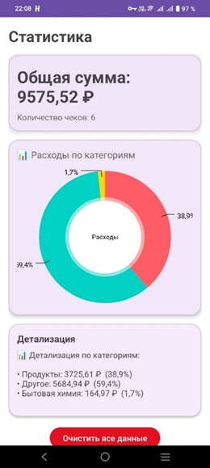

# Интеллектуальная система управления личными финансами

Мобильное приложение для автоматического сканирования чеков, анализа расходов и управления личными финансами с использованием OCR и AI-технологий.

---

## Возможности приложения

- Сканирование чеков с использованием OCR
- Автоматическая классификация расходов
- Финансовая аналитика и статистика
- Прогнозирование расходов
- Персональные рекомендации
- Контроль бюджета и уведомления
- Облачная синхронизация через Firebase
- Авторизация пользователей

---

## Используемые технологии

### Мобильная разработка
- Kotlin
- Android SDK
- MVVM Architecture

### Backend и облачные сервисы
- Firebase Authentication
- Firebase Firestore

### OCR и искусственный интеллект
- Yandex Vision OCR
- Yandex AI Studio

### Дополнительные технологии
- Coroutines
- RecyclerView
- Material Design

---

## Архитектура приложения

Приложение построено с использованием архитектурного паттерна MVVM.

### Основные модули:
- Авторизация
- Сканирование чеков
- OCR-обработка
- Классификация расходов
- Аналитика
- Прогнозирование
- Рекомендации
- Облачное хранение данных

---

## Скриншоты приложения

### Экран авторизации


---

### Сканирование чека


---

### Аналитика расходов



---

### Прогнозирование расходов


---

## Структура базы данных

Основные коллекции Firebase Firestore:

- users
- receipts
- receipt_items
- expenses
- budgets
- analytics
- predictions
- recommendations

---

## Функциональные возможности

### Обработка чеков
- Загрузка изображения чека
- OCR-распознавание текста
- Извлечение товаров
- Извлечение цен

### Анализ расходов
- Автоматическая категоризация
- Визуализация статистики
- Анализ финансового поведения

### AI-возможности
- Прогнозирование расходов
- Персональные финансовые рекомендации
- Контроль бюджета

---

## Показатели эффективности

| Метрика | Значение |
|---|---|
| Точность OCR | 85–90% |
| Точность классификации | 80%+ |
| Время загрузки аналитики | < 2 сек |
| Успешно пройденные тесты | 95%+ |

---

## Установка и запуск

### Клонирование репозитория

```bash
git clone https://github.com/Zenderok2/intelligent_personal_finance_management_system.git
